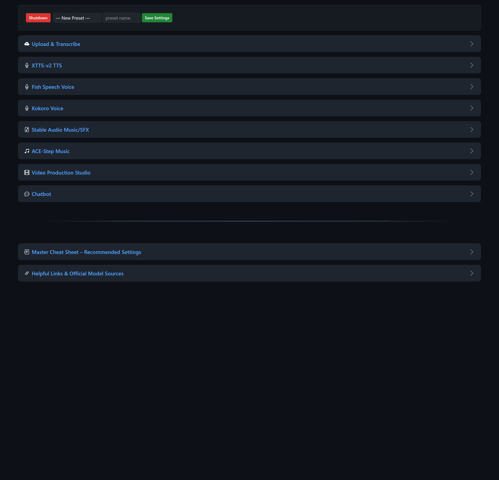

# LocalSoundsAPI

   

**Current release:** [v1.1 - One-Click Installer](https://github.com/aivrar/LocalSoundsAPI/releases/tag/v1.1)

**The ultimate portable, offline all-in-one audio studio**
Text-to-Speech · Transcription - Subtitles - Music Generation · Sound Effects · Video Production · AI Chatbot



**LocalSoundsAPI** gives you both a full-featured **browser-based web interface** and a complete **local REST API** — use it interactively or call it from scripts, other apps, or automation tools.

Everything runs locally from one folder — no installation, no internet needed after setup.

### Included Engines (all fully local & offline)
- **XTTS v2** – Top-tier multilingual voice cloning with speaker embeddings
- **Fish Speech** – Extremely fast and expressive cloned voices
- **Kokoro 82M** – Lightning-fast English TTS with 20 premium built-in voices
- **Stable Audio Open 1.0** – Text-to-music and sound effects (CLAP-scored variants)
- **ACE-Step 3.5B** – Advanced multi-line prompt music generation (style + lyrics)
- **Whisper** – On-demand transcription & quality verification for every generated chunk
- **Local LLM Chatbot** – Built-in llama.cpp assistant for writing prompts, scripts, lyrics, stories, and full projects
- **OpenRouter / LM Studio support** – Optional cloud or external local backends for the chatbot


## Key Features
- **Professional post-processing on every engine**  
  De-reverb, de-essing, loudness normalization (-23 LUFS), intelligent silence trimming, peak limiting, and optional Whisper verification with automatic retries.

- **Full project system**  
  Save jobs with progress tracking, automatic recovery (`##recover##`), and persistent `job.json` files.

- **Powerful built-in Chatbot**  
  Helps you write perfect prompts, lyrics, stories, or entire scripts. Responses can be sent directly to any TTS or music engine with one click.

- **Per-model device selection**  
  Every model (XTTS, Fish, Kokoro, Stable Audio, ACE-Step, Whisper, local LLM) can be loaded on CPU or any available GPU independently — perfect for mixing heavy and light models.

- **Run multiple instances**
  Use `(portable) LocalSoundsAPI-Multi.bat` or the **Launcher GUI** to launch several copies on different ports — great for parallel generation or different model setups.

- **GUI Launcher**
  A tkinter desktop app (`launcher.bat`) that auto-detects GPUs, manages multiple instances, downloads models and tools, and consolidates all server logs into one window — no more separate cmd windows.

- **Video production tool**  
  Turn any audio + transcription into a subtitled video (horizontal/vertical, solid color, transparent, or image/video background).

- **Settings presets** – Save and load all your favorite parameters instantly.

## Quick Start – Fully Portable (No Installation)

1. **Download the repository code**  
   Use `git clone https://github.com/aivrar/LocalSoundsAPI.git`, or choose **Code → Download ZIP** on GitHub and extract it anywhere you like.

2. **Run the one-click setup**
   Double-click **`install.bat`**. It downloads the required portable Python environment and audio tools from the newest [compatible dependency bundle on GitHub Releases](https://github.com/aivrar/LocalSoundsAPI/releases), verifies their SHA-256 hashes, extracts them into the correct folders, and opens the launcher. No administrator rights or system Python are needed. The initial download is about 2.1 GB.

   You can also double-click **`launcher.bat`** immediately after cloning; if the required files are missing, it starts `install.bat` automatically.

3. **Launch the app**
   - **Launcher GUI (recommended):**
     Double-click `launcher.bat`
     → Opens a desktop app where you can select GPUs, add instances on any port, start/stop them, view all logs in one place, and download models or tools.

   - **Single instance (simple):**
     Double-click `(portable) LocalSoundsAPI-Single.bat`
     → Starts on port **5006** and opens http://127.0.0.1:5006 in your browser.

   - **Multiple instances (command-line):**
     Double-click `(portable) LocalSoundsAPI-Multi.bat`
     → Asks how many instances and starting port, then opens separate cmd windows for each.

**First use of each engine:** Its AI model downloads on demand (about 8–12 GB for all models). You can also pre-download selected models from the launcher's **Models & Tools** tab. Downloads can take 10–40 minutes depending on your connection.

That's it – completely offline and portable after the first run!

## Important Folders
- `models/` – Place or auto-download TTS/music models here
- `voices/` – Your reference voice samples for cloning
- `projects_output/` – All saved jobs and final outputs
- `brain/` – Chatbot history, archives, and system prompts
- `settings/` – Your saved parameter presets
- `bin/` – Bundled ffmpeg, rubberband, eSpeak-ng
- `python/` – Complete portable Python environment


## Project Structure
```
project-root/
├── ACE-Step/                  # Bundled ACE-Step repo (music generation)
├── bin/                       # Portable tools
│   ├── ffmpeg/
│   ├── rubberband/
│   └── espeak-ng/
├── brain/                     # Chatbot memory
│   ├── context_history/       # Current + archived chats
│   └── system_prompt.json
├── fish-speech/               # Bundled Fish Speech repo
├── models/                    # All models (auto-downloaded or placed here)
│   ├── XTTS-v2/
│   ├── fish-speech-1.5/
│   ├── kokoro-82m/
│   ├── stable-audio-open-1.0/
│   ├── ace_step/
│   └── clap-htsat-unfused/
├── projects_output/           # Saved jobs and final outputs
├── voices/                    # Your reference voice samples
├── settings/                  # Saved parameter presets
├── static/                    # Web UI (CSS, JS, icons)
├── templates/                 # HTML pages
├── routes/                    # All Flask endpoints
├── python/                    # Portable Python environment (from the 7z)
├── scripts/install.ps1        # Download, verification, and extraction logic
├── install.bat                # One-click first-time setup
├── launcher.py                # GUI launcher (instance manager, model downloads)
├── launcher.bat               # Runs the launcher with portable Python
├── (portable) LocalSoundsAPI-Single.bat
├── (portable) LocalSoundsAPI-Multi.bat
├── main.py
├── config.py
└── requirements.txt
```


## Why This Feels So Smooth
- **Completely self-contained** – The bundled portable Python environment is isolated from your system Python. No pip installs, no conda environments, no dependency conflicts, no PATH headaches. Just extract and run.
- **Truly offline** – After the initial model downloads (which you can do once), everything works 100% without internet.
- **No admin rights needed** – Perfect for work/school computers or USB stick setups.
- **Instant multi-GPU support** – Load heavy models on your best GPU and lighter ones (Whisper, Kokoro, Fish) on another or on CPU — all from the same interface.

### Tips for the Best Experience
- **First run?** Let the app auto-download the models you need (XTTS, Fish, Kokoro, Stable Audio, ACE-Step, CLAP, Whisper). It only happens once per model.
- **Low VRAM?** Use the per-model device selectors — keep big models on your strongest GPU and run Whisper/Kokoro on CPU or a smaller card.
- **Want to generate faster?** Launch multiple instances with `LocalSoundsAPI-Multi.bat` — one for TTS, one for music, one for the chatbot, etc.
- **Chatbot for content creation** – Stuck on a prompt or lyric? Ask the built-in assistant — then click the little icons under its reply to send the text straight to XTTS, Fish, Kokoro, Stable Audio, or ACE-Step.
- **Save everything you like** – Use the “Save Path” field to create permanent projects in `projects_output/`. Temporary generations disappear when you close the app (unless saved).

Enjoy a clean, powerful, completely local creative workflow — no cloud, no subscriptions, no compromises! 🎧✨
