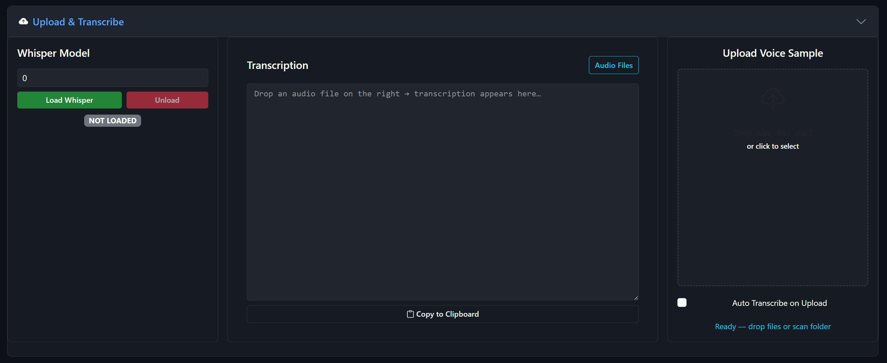

# Chapter 4: Upload and Transcribe

The **Upload & Transcribe** section handles two important tasks: uploading voice reference files for voice cloning, and transcribing audio to text using OpenAI's Whisper model.

## Section Layout

When you expand this section, you'll see three columns:

| Left | Center | Right |
|------|--------|-------|
| Whisper Model controls | Transcription text / Audio file list | Upload dropzone |

## Uploading Voice Reference Files

The right column contains a drag-and-drop upload zone. This is where you upload voice samples that you want to clone with XTTS or Fish Speech.

### How to Upload

1. **Drag and drop** a `.wav`, `.flac`, or `.mp3` file onto the upload zone, OR
2. **Click** the upload zone to open a file picker

Uploaded files are saved to the `voices/` directory and immediately become available in the voice selection dropdowns of XTTS and Fish Speech.

### Tips for Good Voice Reference Files

- **Duration:** 10-30 seconds of clear speech works best
- **Quality:** Use clean audio without background music, echo, or noise
- **Content:** The reference should contain natural, varied speech -- avoid monotone readings
- **Format:** WAV is preferred for best quality, but MP3 and FLAC work too

### Auto Transcribe on Upload

Below the upload zone, there's a checkbox labeled **"Auto Transcribe on Upload"**. When enabled, the app will automatically transcribe your uploaded voice file using Whisper as soon as the upload completes. This is useful for verifying that Whisper can clearly understand the reference audio -- if the transcription looks garbled, the voice sample may not be clean enough for good cloning results.

## The Whisper Transcription Model

The left column contains the Whisper model controls.

### Loading Whisper

1. Select a **device** from the dropdown (GPU recommended for speed)
2. Click **Load Whisper**
3. Wait for the status badge to show "LOADED"

The Whisper model size is configured in `config.py`:

| Model | File | VRAM | Speed | Accuracy |
|-------|------|------|-------|----------|
| base.en | base.en.pt | ~1.5 GB | Very fast | Good |
| medium.en | medium.en.pt | ~5 GB | Moderate | Very good |
| large-v3 | large-v3.pt | ~10 GB | Slow | Best |

The default is `medium.en` which gives the best balance of speed and accuracy for English audio.

### Unloading Whisper

Click **Unload** to free the GPU memory when you're done transcribing.

## Transcribing Audio

There are two ways to reach transcription:

### Method 1: Upload and Auto-Transcribe
1. Enable the "Auto Transcribe on Upload" checkbox
2. Upload a voice file
3. The transcription appears automatically in the center text area

### Method 2: Select from Audio Files
1. In the center column, click **"Audio Files"** to switch to the file list view
2. A dropdown shows all audio files that have been uploaded
3. Select a file and click **"Transcribe Selected"**
4. Click **"Back"** to see the transcription text

### Transcription Output

The transcription appears in the center column's text area as plain text. Below it, a **"Copy to Clipboard"** button lets you quickly copy the full transcription.

Behind the scenes, Whisper also generates:
- **Word-level timestamps** -- stored as a `_timing.json` file alongside the voice file
- **Transcription cache** -- if you transcribe the same file again, it returns instantly from cache

## When Is Whisper Used?

Whisper is used in several places throughout the app:

1. **Voice reference transcription** -- As described above
2. **TTS verification** -- When "Verify with Whisper" is enabled (in XTTS, Fish, or Kokoro settings), the app transcribes each generated audio chunk and compares it to the input text. If the accuracy is below the tolerance threshold, it retries the generation.
3. **Video production transcription** -- In the Video Production Studio, Whisper generates subtitles (SRT files) from audio
4. **Standalone transcription** -- You can transcribe any audio file for its text content

## Whisper Verification in TTS

This is one of LocalSoundsAPI's most powerful features. When enabled, after each chunk of text is converted to speech, the app:

1. Runs Whisper on the generated audio
2. Compares the transcription to the original input text
3. Calculates an accuracy score
4. If the score is below the tolerance threshold (e.g., 80%), it retries the generation

This catches garbled audio, skipped words, and hallucinated content automatically. The "Accuracy" slider in each TTS engine's settings panel controls this threshold.

**Trade-offs:**
- **Higher accuracy (85-95%)** = Stricter checking, more retries, slower but safer
- **Lower accuracy (70-80%)** = More forgiving, faster, occasional imperfect output
- **Turned off** = Fastest, no quality checking, results may vary

---

*The Upload & Transcribe section showing the Whisper model controls (left), transcription text area with Copy to Clipboard button (center), and the voice sample upload dropzone (right).*
