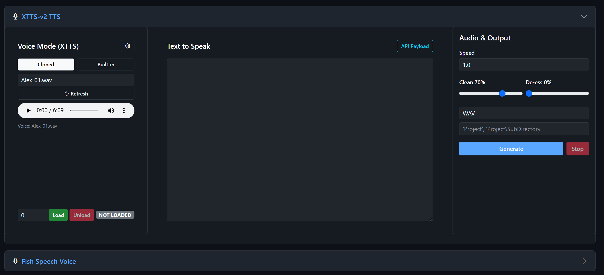

# Chapter 5: XTTS-v2 Voice Cloning

XTTS-v2 (by Coqui AI) is the most versatile text-to-speech engine in LocalSoundsAPI. Its standout feature is **voice cloning** -- give it a short audio sample of any voice, and it can generate new speech that sounds like that person. It also comes with 59 built-in speaker presets.

## When to Use XTTS

- You need to **clone a specific voice** from a reference recording
- You want **multilingual** speech generation
- You want a balance between quality and speed
- You want access to a large library of **built-in voices**

## Section Layout

| Left Column | Center Column | Right Column |
|-------------|---------------|--------------|
| Voice mode (Cloned/Built-in) | Text to speak | Speed control |
| Voice selection dropdown | API Payload view | Clean (de-reverb) slider |
| Device selection | | De-ess slider |
| Load/Unload + status | | Output format |
| Gear icon for settings | | Project save path |
| | | Generate/Stop buttons |
| | | Results/playback |

## Loading the Model

1. In the left column, select your **device** (GPU 0 recommended)
2. Click the green **Load** button
3. Wait for the status badge to show **LOADED** (green)

First-time loading downloads the model from Hugging Face (~6 GB).

## Voice Modes

At the top of the left column, two buttons let you switch between voice modes:

### Cloned Mode
Uses your uploaded voice reference files from the `voices/` directory.

1. Click **Cloned**
2. Select a voice from the dropdown
3. Click **Refresh** if you've recently uploaded new voices
4. An audio player appears so you can preview the reference voice

### Built-in Mode
Uses one of 59 pre-trained speaker voices included with the model.

1. Click **Built-in**
2. Select a speaker from the dropdown
3. Click **Refresh** to reload the speaker list

Built-in voices are consistent and reliable. They're a great choice when you don't need a specific cloned voice.

## Writing Your Text

In the center column, type or paste the text you want to convert to speech.

**Tips for best results:**
- Use proper punctuation -- commas, periods, and question marks help the model produce natural pacing
- Break very long text into paragraphs. The app automatically chunks long text into smaller pieces for processing
- Avoid unusual symbols, emojis, or excessive formatting
- Numbers and abbreviations are generally handled well, but spelling them out can improve consistency

## Inference Settings (Gear Panel)

Click the gear icon in the left column to reveal the inference settings:

### Temperature (default: 0.65)
Controls the randomness of the generated speech.

| Value | Effect |
|-------|--------|
| 0.50-0.60 | More predictable, slightly robotic |
| 0.65-0.75 | Recommended -- natural and stable |
| 0.80-0.90 | More expressive but may slur or wander |
| > 0.90 | Unpredictable, likely to produce artifacts |

### Repetition Penalty (default: 2.1)
Prevents the model from repeating words or getting stuck in loops. Higher values reduce repetition more aggressively.

| Value | Effect |
|-------|--------|
| 1.0-2.0 | Minimal intervention, may stutter on long text |
| 2.0-4.0 | Good for most text |
| 4.0-6.0 | Aggressive -- use for very long paragraphs |

### Accuracy / Tolerance (default: 0.80)
When Whisper verification is enabled, this sets the minimum acceptable accuracy score. Generated audio below this threshold is regenerated.

- Drag the slider to adjust (range: 0.70 to 0.98)
- The current value displays next to the label

### Verify with Whisper (default: on)
When checked, each generated audio chunk is verified against the original text using Whisper. This catches errors but adds processing time. See Chapter 4 for details.

### Skip Audio Processing
When checked, bypasses the post-processing pipeline (normalization, de-reverb, de-ess) and only applies basic trimming. Use this if you plan to do your own audio processing externally.

## Audio Output Controls (Right Column)

### Speed (default: 1.0)
Controls playback speed. The app uses RubberBand for pitch-corrected speed changes, so the voice pitch stays natural even at different speeds.

| Value | Effect |
|-------|--------|
| 0.5-0.8 | Slow, deliberate speech |
| 0.9-1.1 | Natural speed |
| 1.2-1.5 | Faster narration |
| 1.6-2.0 | Very fast, may lose clarity |

### Clean / De-Reverb (default: 70%)
Reduces room reverb and echo in the generated audio. Higher values apply more aggressive cleaning.

- **0%** -- No cleaning, raw output
- **50-80%** -- Recommended for most cases
- **100%** -- Maximum cleaning, may sound slightly processed

### De-Ess (default: 0%)
Reduces harsh "S" and "SH" sounds (sibilance). Only increase this if you notice distracting sibilance.

- **0%** -- No de-essing (default)
- **20-50%** -- Mild sibilance reduction
- **50-100%** -- Aggressive de-essing

### Output Format
Choose from WAV, FLAC, MP3, OGG, or M4A.

### Save Path
Enter a project folder name (e.g., `MyAudiobook`) to save output to `projects_output/MyAudiobook/`. Leave blank for temporary output.

## Generating Speech

1. Make sure the model is loaded (green badge)
2. Select your voice (cloned or built-in)
3. Type your text in the center area
4. Adjust output settings as needed
5. Click **Generate**

The generation status appears below the Generate button, showing progress for multi-chunk text. When complete, an audio player appears in the results area at the bottom of the right column.

### Stopping Generation
Click **Stop** to cancel a generation in progress. Already-completed chunks are preserved.

## Job Recovery

If a long generation fails partway through (due to a crash, timeout, or repeated Whisper failures), the app saves a `job.json` file in the project directory. To recover:

1. Type `##recover##` in the text input area
2. Make sure the same project save path is set
3. Click **Generate**

The app reads the `job.json` file and retries only the failed chunks, keeping all the successfully generated chunks intact.

You can also manually edit the `job.json` file to:
- Mark specific chunks as needing retry
- Disable Whisper verification for problematic chunks (`"verify_whisper": false`)
- Adjust other per-chunk parameters

## The API Payload

Click **"API Payload"** in the center column to see the exact dictionary that will be sent to the `/infer` endpoint. You can click **"Copy DICT"** to copy it for use in scripts or external tools.

---

*The XTTS-v2 section in Cloned voice mode. Left: voice selection with Cloned/Built-in toggle, reference audio preview player, and device/Load controls. Center: text input area with API Payload button. Right: Speed, Clean, De-ess sliders, output format, project path, and Generate/Stop buttons.*
