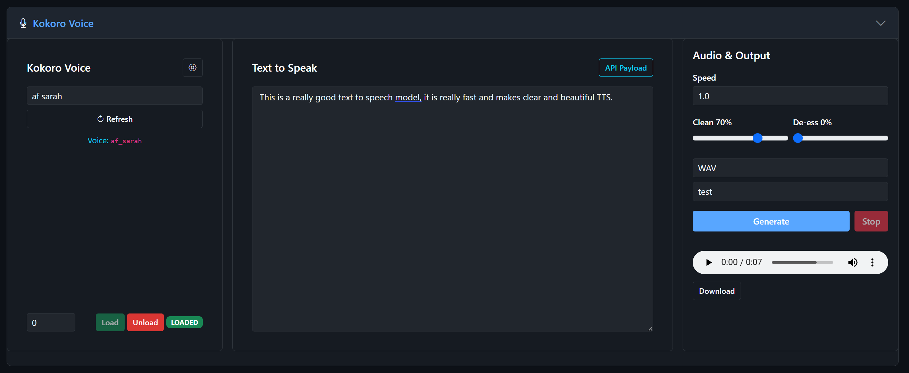

# Chapter 7: Kokoro TTS

Kokoro is a compact, blazing-fast text-to-speech engine with only 82 million parameters. It's the speed champion of LocalSoundsAPI -- capable of real-time or faster generation on both CPU and GPU. Kokoro comes with 19 high-quality English voices and uses minimal memory.

## When to Use Kokoro

- You need **fast, real-time speech generation**
- You're working on a machine with **limited GPU memory**
- You want to generate speech on **CPU** at reasonable speeds
- You need **quick previews** before committing to a slower, higher-quality engine
- You're building a **real-time application** that needs low-latency TTS

## How Kokoro Compares

| Feature | XTTS-v2 | Fish Speech | Kokoro |
|---------|---------|-------------|--------|
| Speed | Moderate | Slow | Very fast |
| VRAM | ~6 GB | ~8 GB | ~2 GB |
| CPU performance | Slow | Very slow | 30-40x real-time |
| Voice cloning | Yes | Yes | No (preset voices only) |
| Voice count | 59 built-in + cloned | Cloned only | 19 preset voices |
| Quality | Very good | Excellent | Good |

## Available Voices

Kokoro includes 19 English voices split into female (af_) and male (am_) prefixes:

### Female Voices
| Voice ID | Name |
|----------|------|
| af_alloy | Alloy |
| af_aoede | Aoede |
| af_bella | Bella |
| af_heart | Heart |
| af_jessica | Jessica |
| af_kore | Kore |
| af_nicole | Nicole |
| af_nova | Nova |
| af_river | River |
| af_sarah | Sarah |
| af_sky | Sky |

### Male Voices
| Voice ID | Name |
|----------|------|
| am_adam | Adam |
| am_echo | Echo |
| am_eric | Eric |
| am_fenrir | Fenrir |
| am_liam | Liam |
| am_michael | Michael |
| am_onyx | Onyx |
| am_puck | Puck |

**Note:** Kokoro does not support voice cloning. You can only use the preset voices listed above.

## Section Layout

Same three-column layout as the other TTS engines:

| Left Column | Center Column | Right Column |
|-------------|---------------|--------------|
| Voice selection | Text to speak | Speed |
| Device selection | API Payload view | Clean / De-reverb |
| Load/Unload | | De-ess |
| Gear icon | | Output format |
| | | Save path |
| | | Generate/Stop |
| | | Results |

## Loading the Model

1. Select a voice from the **Kokoro Voice** dropdown
2. Select your **device** (CPU works great with Kokoro!)
3. Click **Load**
4. Wait for the status badge to show LOADED

**Requirement:** Kokoro requires eSpeak-ng for phoneme processing. Make sure the `bin/espeak-ng/` directory contains `libespeak-ng.dll` and the `espeak-ng-data` folder. See Chapter 2 for setup details.

## Inference Settings (Gear Panel)

### Creativity (Temperature) (default: 0.7)
Controls expressiveness and variation.

| Value | Effect |
|-------|--------|
| 0.1-0.5 | Very stable, almost monotone |
| 0.5-0.8 | Natural expressiveness |
| 0.8-1.0 | Very expressive, may be inconsistent |
| > 1.0 | Experimental, often too chaotic |

### Diversity (Top P) (default: 0.9)
Controls the range of vocal variation.

| Value | Effect |
|-------|--------|
| 0.5-0.7 | Predictable output |
| 0.7-0.9 | Good variation |
| > 0.9 | Maximum diversity |

### Accuracy / Tolerance (default: 0.80)
Whisper verification threshold.

**Important note for Kokoro:** The cheat sheet recommends setting Whisper verification to **Off or 92%+** for Kokoro. Lower verification thresholds tend to produce many false failures with Kokoro's output characteristics.

### Verify with Whisper (default: on)
Quality checking. Consider turning this off for Kokoro if you experience excessive retries.

### Skip Audio Processing
Bypasses normalization and cleaning.

## Audio Output Controls

- **Speed** (default: 1.0) -- Range: 0.5 to 2.0. Kokoro handles speed changes well. The cheat sheet recommends 1.3-1.6 for narration. Above 1.7, voices can sound unnaturally high-pitched ("chipmunk").
- **Clean / De-Reverb** (default: 70%)
- **De-Ess** (default: 0%)
- **Output Format** -- WAV, MP3, OGG, FLAC, M4A
- **Save Path** -- Project folder or blank for temp

## Generating Speech

1. Load the model and select a voice
2. Type your text
3. Click **Generate**
4. Results appear almost instantly for short text

## Known Limitation: Unknown Words

Kokoro uses eSpeak-ng for phoneme conversion. If a word is not in eSpeak's dictionary (unusual proper names, made-up words, some technical jargon), Kokoro may:

- Skip the word entirely (silence where the word should be)
- Mispronounce it significantly

**Workarounds:**
- Spell out phonetically: "Elon" instead of a problematic name
- Use the Whisper verification to catch silent/missing words
- Switch to XTTS or Fish Speech for text with many unusual names

---

*Kokoro Voice with the "af sarah" voice loaded (green LOADED badge). A completed generation shows the audio player in the right column with playback controls and a Download button. Note the fast generation time -- Kokoro is the speed champion.*
