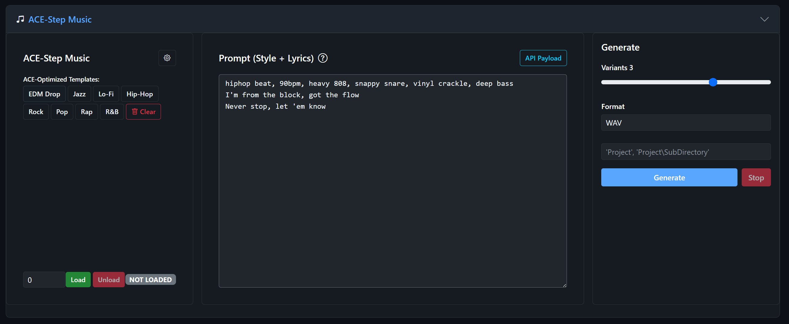

# Chapter 9: ACE-Step -- AI Music Generation

ACE-Step is a specialized music generation model designed for creating full-length songs with lyrics, style control, and advanced diffusion parameters. While Stable Audio excels at short clips and sound effects, ACE-Step is purpose-built for music tracks up to 60 seconds.

## When to Use ACE-Step

- You want to generate **music with lyrics**
- You need **genre-specific** music (EDM, jazz, hip-hop, lo-fi, rock, pop, etc.)
- You're creating **longer musical passages** (up to 60 seconds)
- You want fine-grained control over the **diffusion process**

## ACE-Step vs. Stable Audio

| Feature | Stable Audio | ACE-Step |
|---------|-------------|----------|
| Max duration | 47 seconds | 60 seconds |
| Lyrics support | No | Yes |
| Genre templates | Basic | Extensive |
| Sound effects | Excellent | Not designed for SFX |
| Music quality | Good for clips | Better for songs |
| VRAM | ~10 GB | ~7 GB |
| Advanced controls | Basic | Extensive diffusion params |

## Section Layout

| Left Column | Center Column | Right Column |
|-------------|---------------|--------------|
| Genre templates | Prompt (Style + Lyrics) | Variants (1-4) |
| Device selection | API Payload view | Output format |
| Load/Unload | | Save path |
| Gear icon for settings | | Generate/Stop |
| | | Results |

## Loading the Model

1. Select your **device** (GPU required)
2. Click **Load**
3. First load downloads the ACE-Step model files

## Genre Templates

The left column provides quick-start genre templates:

| Template | Style |
|----------|-------|
| EDM Drop | Electronic dance music with drops and synths |
| Jazz | Jazz ensemble with improvisation |
| Lo-Fi | Lo-fi hip-hop / chill beats |
| Hip-Hop | Hip-hop instrumental |
| Rock | Rock band arrangement |
| Pop | Pop production |
| Rap | Rap beat and flow |
| R&B | R&B groove |
| Clear | Clears the prompt |

Clicking a template fills the prompt area with an optimized style description and sample lyrics.

## Writing Prompts

ACE-Step uses a special prompt format where the **first line defines the style** and the **remaining lines are lyrics**:

```
edm drop, 128bpm, supersaw, punchy kick, sidechain, riser
I'm on the edge, feel the drop
Let it go, hands up high
We're flying through the night
Nothing's gonna stop us now
```

### Style Line (First Line)
Describe the genre, tempo, instruments, and mood:
- `lo-fi hip-hop, 85bpm, dusty vinyl, mellow piano, rain ambiance`
- `epic cinematic rock, 140bpm, distorted guitars, pounding drums, orchestral strings`
- `smooth jazz, 100bpm, saxophone solo, walking bass, brush drums`

### Lyrics (Remaining Lines)
Write the lyrics you want sung or rapped. Keep them simple and rhythmic:
- Short, punchy phrases work better than long sentences
- Match the rhythm to the specified BPM
- Avoid overly complex vocabulary

### Instrumental Only
To generate music without vocals, simply provide only the style line with no lyrics, or include `instrumental` in your style description.

## Inference Settings (Gear Panel)

ACE-Step has the most extensive settings of any module. Click the gear icon to access them.

### Steps (default: 60)
Diffusion steps. More steps = better quality, slower generation.

| Value | Effect |
|-------|--------|
| 10-30 | Fast preview, rough quality |
| 40-60 | Recommended -- good quality |
| 60-100 | High quality, slower |
| > 100 | Diminishing returns |

### Duration (default: 10.0 seconds)
Length of the generated music. Range: 1 to 60 seconds.

### Guidance (default: 3.5)
Main CFG (classifier-free guidance) scale. Controls how closely the output follows your prompt.

| Value | Effect |
|-------|--------|
| 1-2 | Very loose, creative |
| 3-5 | Recommended range |
| 5-7 | Tight prompt following |
| > 7 | May over-constrain the output |

### Omega (default: 1.0)
Frequency scaling parameter for the diffusion process.

### Min Guidance (default: 1.0)
Minimum guidance value during the generation process. Used with guidance decay.

### Guidance Interval (default: 0)
Number of steps at the beginning where full guidance is applied before decaying.

### Guidance Decay (default: 1.0)
Rate at which guidance decays over the diffusion steps:
- **1.0** -- No decay (constant guidance)
- **< 1.0** -- Guidance decreases over time (more creative ending)
- **> 1.0** -- Guidance increases over time (tighter ending)

### Guidance Text (default: 0.0)
Additional guidance weight specifically for the text/style component.

### Guidance Lyric (default: 0.0)
Additional guidance weight specifically for the lyrics component.

### Scheduler
The diffusion scheduler algorithm:
- **euler** -- Standard Euler method (default, recommended)
- **pingpong** -- Alternating step sizes, can produce different textures

### CFG Type
- **cfg** -- Standard classifier-free guidance
- **ucfg** -- Unconditional classifier-free guidance

### ERG Flags
Three checkboxes for ablation experiments:
- **ERG Tag** -- Ablates the tag/style conditioning
- **ERG Lyric** -- Ablates the lyric conditioning
- **ERG Diff** -- Ablates the diffusion guidance

These are advanced experimental options. Leave them unchecked for normal use.

### Seed (default: -1)
Random seed. Set a specific number for reproducible results, or -1 for random.

### OSS Steps
Optional step schedule override. Enter comma-separated step indices (e.g., `1,3,5`) for custom scheduling. Leave blank for default.

## Generating Music

1. Load the model
2. Write your prompt (style line + lyrics) or use a template
3. Set the duration and number of variants
4. Click **Generate**

### Results
Like Stable Audio, each variant is scored by CLAP and displayed ranked. Listen to each variant and choose the best one.

## Tips for Better Music

1. **Start with templates.** The genre templates are tuned for good results. Modify them rather than starting from scratch.

2. **Keep durations reasonable.** 10-30 seconds produces the most coherent results. 60 seconds can lose structure.

3. **Match lyrics to tempo.** Short, rhythmic phrases at the right syllable count for your BPM produce better singing.

4. **Use 3-4 variants.** Music generation has high variance. Multiple attempts ensure at least one good result.

5. **The cheat sheet recommends:** Steps 45-55, Guidance 4.5-6.0, first line = genre/style, rest = lyrics.

---



*The ACE-Step section with genre template buttons (EDM Drop, Jazz, Lo-Fi, Hip-Hop, Rock, Pop, Rap, R&B) and a hip-hop prompt loaded. The first line defines the style (genre, BPM, instruments) and the remaining lines are lyrics. Right column shows Variants and Format controls.*
