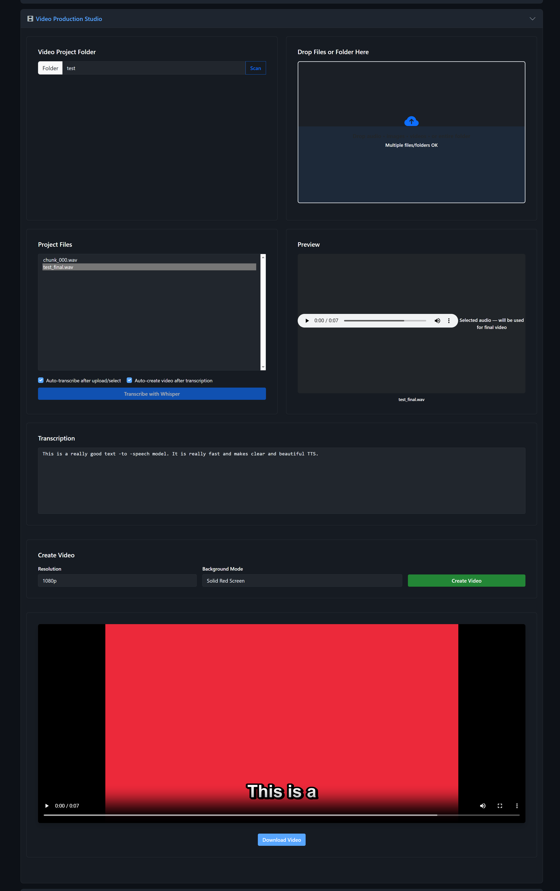

# Chapter 10: Video Production Studio

The Video Production Studio brings together audio, transcription, and video creation in one workflow. Upload audio files, automatically generate subtitles with Whisper, and create videos with various background options and subtitle overlays -- all without leaving the app.

## When to Use the Production Studio

- You want to create **subtitled videos** from audio narration
- You need **SRT subtitle files** for your audio content
- You want to combine **audio with images or video backgrounds**
- You're building a pipeline: **generate speech -> transcribe -> create video**

## Section Layout

The Production Studio uses a different layout from the TTS sections. It has four rows:

### Row 1: Project Setup
| Left Half | Right Half |
|-----------|------------|
| Video Project Folder selector | File/Folder dropzone |

### Row 2: Files and Preview
| Left Half | Right Half |
|-----------|------------|
| Project files list | Preview area |
| Auto-transcribe checkbox | |
| Auto-create video checkbox | |
| Transcribe button | |

### Row 3: Transcription
Full-width transcription text display

### Row 4: Video Creation
Full-width video settings and Create Video button

### Result Area
Video player with download link

## Step 1: Set Up a Project Folder

In the top-left card:

1. Type a **project name** in the text field (e.g., `my_video_project`)
   - A simple name creates a folder under `projects_output/`
   - You can also type a full path (e.g., `E:\projects\my_video`)
2. Click **Scan** to load any existing files in that folder

The "Folder" label is also clickable -- it opens a native folder picker dialog.

## Step 2: Upload Media Files

The top-right card contains a drag-and-drop zone. You can:

- **Drag audio files** (.wav, .mp3, .flac, .ogg, .m4a)
- **Drag video files** (.mp4, .webm, .mov, .avi, .mkv)
- **Drag image files** (.jpg, .png, .gif, .bmp, .webp)
- **Drag an entire folder** of files
- **Click** the dropzone to use a file picker

Uploaded files are copied into your project folder. The upload status shows progress.

**Tip:** You don't need to upload files manually if you've been generating TTS with a save path. Files generated by XTTS, Fish Speech, or Kokoro to a project folder are automatically available here.

## Step 3: Select and Preview Files

The left half of Row 2 shows a list of all files in your project folder. Click any file to:

- **Audio files:** Preview with an audio player
- **Image files:** Preview in the right-side preview area
- **Video files:** Preview with a video player

## Step 4: Transcribe Audio

Before creating a video, you need subtitles. These are generated by transcribing the audio with Whisper.

### Prerequisites
Make sure Whisper is loaded (see Chapter 4 -- Upload & Transcribe section, or the Upload & Transcribe panel at the top of the main page).

### Manual Transcription
1. Select an audio file from the project files list
2. Click **"Transcribe with Whisper"**
3. The transcription text appears in Row 3
4. Two files are created alongside the audio:
   - `filename.srt` -- Subtitle file with timestamps
   - `filename_timing.json` -- Word-level timing data

### Auto-Transcription
Check **"Auto-transcribe after upload/select"** to automatically transcribe audio files as soon as they're selected or uploaded.

### Transcription Caching
If an audio file has already been transcribed (an SRT file exists), the transcription is loaded from cache instantly. You don't need to re-transcribe.

## Step 5: Create a Video

Once your audio file has been transcribed (an SRT file exists), you can create a video.

### Video Settings (Row 4)

**Resolution:**

| Option | Dimensions | Aspect Ratio |
|--------|-----------|-------------|
| 720p | 1280 x 720 | 16:9 (horizontal) |
| 1080p | 1920 x 1080 | 16:9 (horizontal) |
| 1440p | 2560 x 1440 | 16:9 (horizontal) |
| 4K | 3840 x 2160 | 16:9 (horizontal) |
| 1080p Vertical | 1080 x 1920 | 9:16 (vertical/mobile) |
| 4K Vertical | 2160 x 3840 | 9:16 (vertical/mobile) |

**Background Mode:**

| Mode | Description |
|------|-------------|
| Solid Red Screen | Red background with white subtitles |
| Solid Green Screen | Green screen for chroma keying |
| Solid Blue Screen | Blue screen alternative |
| Cycle Images / Videos | Uses images and videos from the project folder as background |
| Transparent Background | WebM format with alpha channel transparency |

### Creating the Video

1. Select the audio file you want to use (must have an SRT subtitle file)
2. Choose your resolution
3. Choose your background mode
4. Click **"Create Video"**

FFmpeg handles the video creation. This may take a minute or two depending on the audio length and resolution.

### Auto-Create Video
Check **"Auto-create video after transcription"** to automatically start video creation as soon as transcription completes. Combined with auto-transcribe, this creates a fully automated pipeline:

**Upload audio -> Auto-transcribe -> Auto-create video**

## Step 6: View and Download

When the video is complete, a video player appears at the bottom of the section. You can:

- **Play** the video directly in the browser
- **Download** using the "Download Video" button

The video file is saved in your project folder.

## Background Modes in Detail

### Solid Color Screens
Creates a video with a flat color background and subtitle text overlaid. Useful for:
- **Red:** Default, high contrast with white text
- **Green:** Green screen for video editing compositing
- **Blue:** Alternative chroma key color

### Cycle Images / Videos
Uses all image and video files in your project folder as rotating backgrounds:
- Images display for a duration based on the audio length divided by the number of images
- Videos play sequentially
- This creates dynamic, visually interesting content automatically

### Transparent Background (WebM)
Creates a WebM video with an alpha channel. The background is fully transparent, showing only the subtitle text. This is ideal for overlaying on other video in a video editor.

## The Full Production Pipeline

Here's a typical end-to-end workflow combining multiple features:

1. **Generate speech** using XTTS, Fish, or Kokoro with save path set to `MyProject`
2. **Open Video Production Studio** and set the folder to `MyProject`
3. Click **Scan** -- your generated audio files appear
4. **Upload background images** by dragging them into the dropzone
5. Select an audio file and **transcribe** it
6. Set resolution to 1080p, background to "Cycle Images"
7. Click **Create Video**
8. Download the finished video

---

*The complete Video Production workflow. Top: project folder and file upload dropzone. Middle: project file list with audio preview, auto-transcribe options, and transcription output. Bottom: video creation settings (1080p, Solid Red Screen) and the finished video with burned-in subtitles playing in the browser.*
