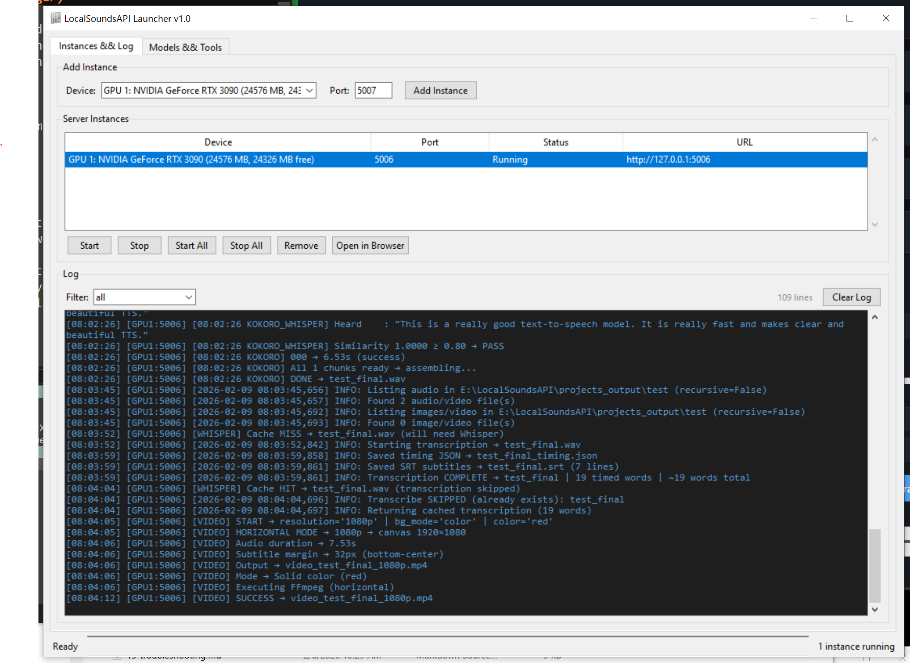
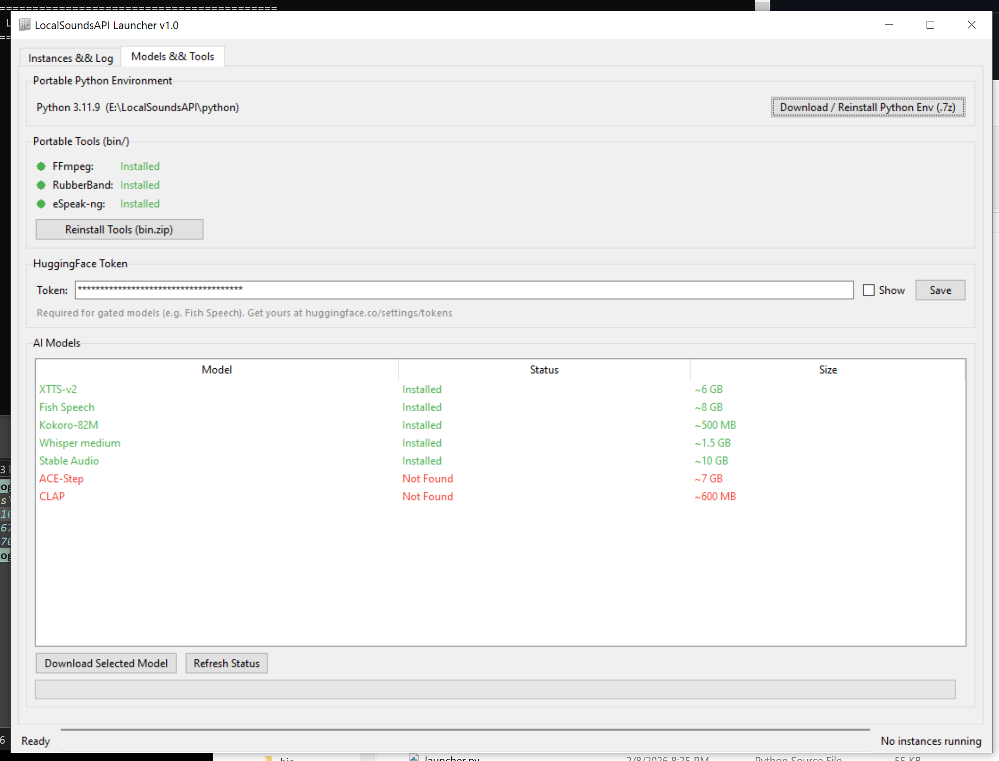

# Chapter 17: Launcher (GUI Instance Manager)

The LocalSoundsAPI Launcher is a tkinter desktop application that replaces the batch-file workflow with a single window for managing multiple server instances, downloading AI models, and monitoring logs.

## Starting the Launcher

Double-click `launcher.bat` or run it from a terminal:

```
launcher.bat
```

This sets up the PATH for the portable Python environment, FFmpeg, and RubberBand, then opens the launcher window.

> **Note:** The launcher requires the portable Python environment (`python\python.exe`) to be installed. If you're using a system Python or virtual environment instead, run `python launcher.py` directly.

---

## Tab 1: Instances & Log

This is the main tab where you manage server instances and view their output.

### Adding an Instance

At the top of the tab you'll find:

1. **Device dropdown** -- Lists all detected NVIDIA GPUs plus a "CPU" option. GPUs are auto-detected using `nvidia-smi`.
2. **Port field** -- The port number for this instance. Defaults to 5006 and auto-increments after each add.
3. **Add Instance button** -- Creates the instance entry in the table below.

Each instance runs an independent copy of LocalSoundsAPI on the selected GPU and port.

### Instance Table

The table shows all configured instances with columns:

| Column | Description |
|--------|-------------|
| Device | The GPU or CPU assigned to this instance |
| Port | The network port (e.g., 5006) |
| Status | Stopped, Starting, Running, or Crashed |
| URL | The address to access this instance in a browser |

### Instance Controls

Buttons below the table:

| Button | Action |
|--------|--------|
| **Start** | Launch the selected instance as a background process |
| **Stop** | Terminate the selected instance |
| **Start All** | Launch all stopped instances |
| **Stop All** | Terminate all running instances |
| **Remove** | Delete the selected instance from the table (stops it first if running) |
| **Open Browser** | Open the instance URL in your default web browser |

You can also double-click any row in the table to open it in your browser.

### How Instances Run

Unlike the batch files (which open separate cmd windows), the launcher runs each instance as a hidden subprocess. All output is captured and displayed in the log viewer below. The subprocess is started with:

- `CUDA_VISIBLE_DEVICES` set to the selected GPU index (for GPU isolation)
- `CREATE_NO_WINDOW` flag (no separate console window)
- Unbuffered output (`-u` flag) for real-time log streaming

### Log Viewer

The dark-themed log panel at the bottom shows timestamped output from all instances. Features:

- **Color-coded entries** -- System messages (yellow/gold) vs server output (light gray)
- **Timestamps** -- Every line prefixed with `[HH:MM:SS]`
- **Instance prefixes** -- Each line tagged with `[GPU0:5006]` (or similar) so you can tell which instance produced it
- **Filter dropdown** -- Show logs from all instances or filter to a specific one
- **Clear button** -- Wipe the log display
- **Line count** -- Shows total visible lines
- **Auto-scroll** -- Automatically follows new output
- **Maximum 5000 lines** -- Older entries are trimmed to prevent memory issues

### Health Polling

Every 15 seconds, the launcher checks each running instance by calling its `/status` endpoint. If an instance responds, the status shows "Running". If it doesn't respond but the process is alive, it shows "Starting". If the process has exited unexpectedly, the status changes to "Crashed".

---

## Tab 2: Models & Tools

This tab provides a dashboard for managing the portable environment, tools, and AI models.

### Portable Python Environment

Shows the current Python version and path. The **Download / Reinstall** button downloads `portable-python-env-v1.7z` from the GitHub releases page and extracts it to the project root. This is a repair/reinstall feature -- the launcher itself is already running on the portable Python.

### Portable Tools (bin/)

Displays status indicators for the three required external tools:

| Tool | What it checks |
|------|---------------|
| **FFmpeg** | `bin/ffmpeg/bin/ffmpeg.exe` exists |
| **RubberBand** | `bin/rubberband/` directory exists |
| **eSpeak-ng** | `bin/espeak-ng/libespeak-ng.dll` exists |

Each tool shows a green dot if found or a red dot if missing.

The **Download All Tools** button downloads `bin.zip` from the GitHub releases page and extracts it into the project root, installing all three tools at once.

### AI Models

A table showing all downloadable AI models:

| Model | Check Path | Approximate Size |
|-------|-----------|-----------------|
| XTTS-v2 | `models/XTTS-v2/` | ~6 GB |
| Fish Speech | `models/fish-speech/` | ~8 GB |
| Kokoro-82M | `models/kokoro-82m/` | ~500 MB |
| Whisper (medium.en) | `models/medium.en.pt` | ~1.5 GB |
| Stable Audio | `models/stable-audio-open-1.0/` | ~10 GB |
| ACE-Step | `models/ace_step/` | ~7 GB |
| CLAP | `models/clap-htsat-unfused/` | ~600 MB |

Each model shows its status:
- **Installed** -- The model files exist on disk
- **Not Found** -- The model hasn't been downloaded yet

Select a model and click **Download Selected** to begin downloading. Models are downloaded from Hugging Face using `huggingface_hub.snapshot_download()` (or the OpenAI Whisper library for Whisper). A progress bar at the bottom of the tab shows download activity.

> **Note:** You don't need to download models through the launcher. They also download automatically the first time you click "Load" in the web interface. The launcher just gives you a way to pre-download models before starting any instances.

### Download Progress

A progress bar and status label at the bottom of the Models & Tools tab shows:

- Download percentage for tools/Python env (determinate progress)
- Indeterminate animation for model downloads (since `huggingface_hub` doesn't report granular progress)
- Extraction status after download completes

Only one download can run at a time.

---

## Closing the Launcher

When you close the launcher window:

1. If any instances are running, a confirmation dialog appears
2. All running instances are stopped gracefully (using `taskkill` on Windows)
3. The window closes

---

## Tips

- **Port collisions** -- The launcher prevents you from adding two instances on the same port.
- **GPU memory** -- Loading the same model on two instances using the same GPU will use double the VRAM. Use different GPUs for different instances when possible.
- **CPU fallback** -- If no NVIDIA GPU is detected, only "CPU" appears in the device dropdown.
- **Batch files still work** -- The existing `.bat` files continue to work alongside the launcher. Use whichever approach you prefer.
- **Crashed instances** -- If an instance status shows "Crashed", check the log for error messages. Common causes are port conflicts and out-of-memory errors.

---



*The Instances & Log tab with a running instance on GPU 1 (RTX 3090) at port 5006. The log viewer shows Flask startup output, model loading, TTS generation, Whisper verification, and video creation -- all captured with timestamped [GPU1:5006] prefixes.*



*The Models & Tools tab showing the portable Python environment, tool status indicators (all green), HuggingFace token entry, and the AI model table with Installed/Not Found status for each model.*
